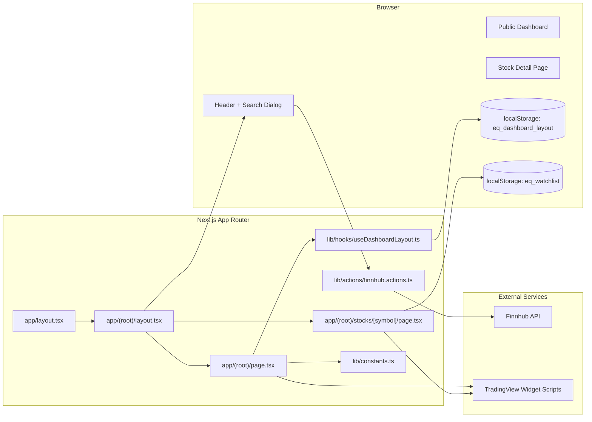
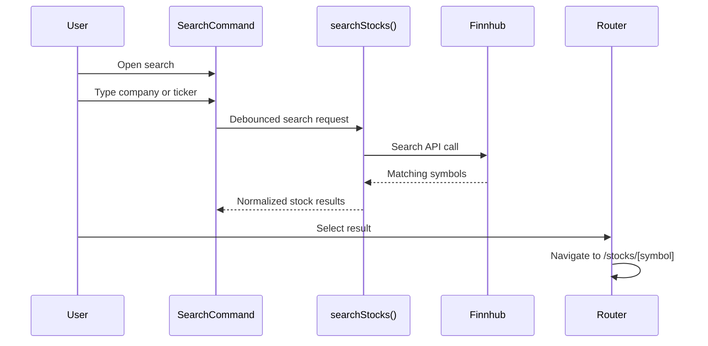

# Equipulse Architecture

Equipulse is a public-first market dashboard with a deliberately small runtime surface.

The active application architecture is built around:

- Next.js App Router for routing, layouts, and server-rendered entry pages
- React client components for interactive dashboard behavior
- TradingView widget embeds for market visualization
- Finnhub-backed server helpers for stock search
- `localStorage` for watchlist and dashboard layout persistence
- no auth, no required database, and no background job layer in the live app

## Stack

| Layer | Technology | Purpose |
|---|---|---|
| Framework | Next.js 16 App Router | Route tree, layouts, page rendering |
| UI | React 19 | Client interactivity and widget composition |
| Styling | Tailwind CSS 4 | App styling and utility classes |
| Dashboard Grid | `react-grid-layout` + `react-resizable` | Draggable, resizable homepage widgets |
| Market Widgets | TradingView embeds | Overview, heatmap, timeline, detail charts |
| Search Data | Finnhub API | Stock search and symbol lookup |
| Client Persistence | `localStorage` | Dashboard layout and watchlist |
| Language and Tooling | TypeScript + ESLint | Type safety and static checks |

## High-Level Architecture



## Route Architecture

```text
app/
├── layout.tsx
├── globals.css
└── (root)/
    ├── layout.tsx
    ├── page.tsx
    └── stocks/
        └── [symbol]/
            └── page.tsx
```

## Runtime Shape

### Public Dashboard

- The homepage renders a TradingView-based dashboard.
- Widget positions and sizes are managed with `react-grid-layout`.
- Layout changes are saved to `localStorage` under `eq_dashboard_layout`.

### Stock Search

- The header loads popular symbols for initial search suggestions.
- Search requests call `searchStocks()` on the server.
- Finnhub responses are normalized before being returned to the UI.

### Stock Detail Page

- `/stocks/[symbol]` renders multiple TradingView widgets for the selected ticker.
- Watchlist state is stored in `localStorage` under `eq_watchlist`.

## Search Request Flow



## Technology Decisions

- TradingView is used for visualization instead of custom chart rendering.
  Reason: fast integration, strong market widgets, low implementation overhead.

- `localStorage` is used instead of accounts or a database.
  Reason: this is a portfolio app and the core experience should work immediately.

- Finnhub is used only for lightweight search and lookup.
  Reason: it keeps the server-side integration narrow and easy to control.

- The app remains public-only.
  Reason: access friction is intentionally low, and cost control should come from limits and caching rather than login.
