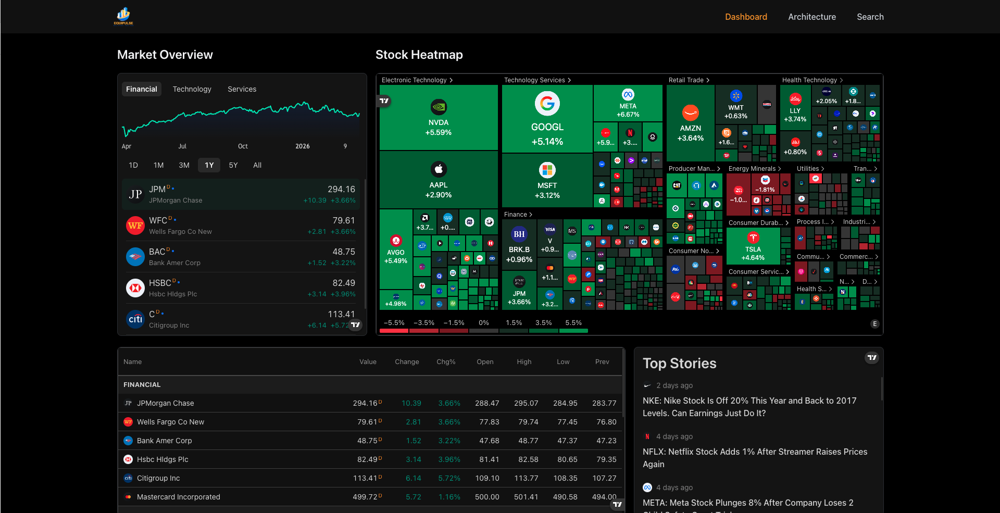
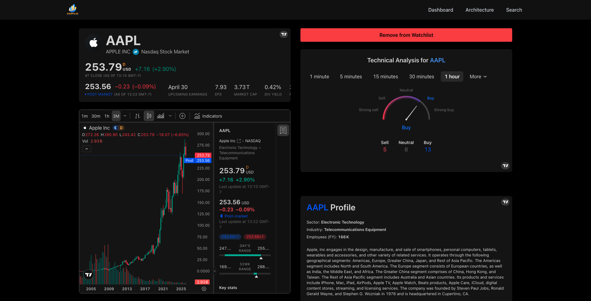
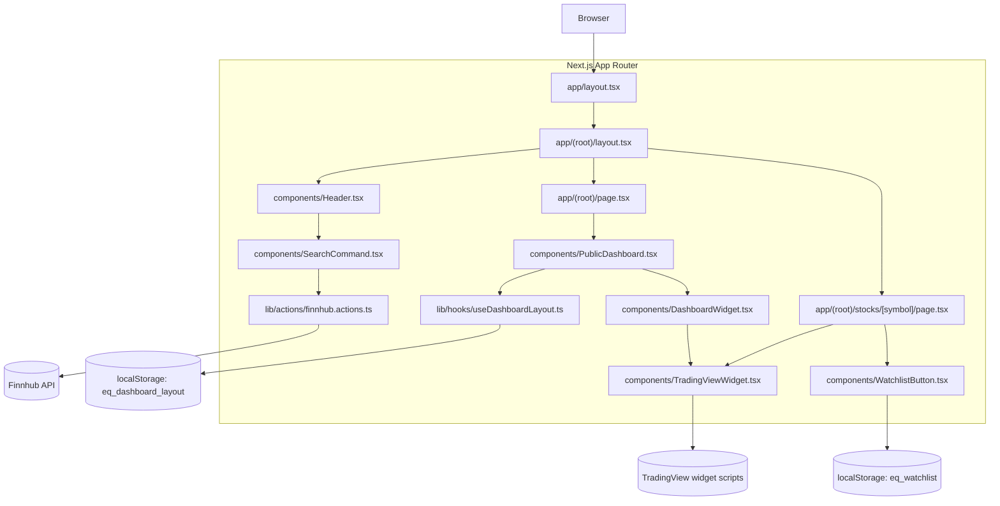
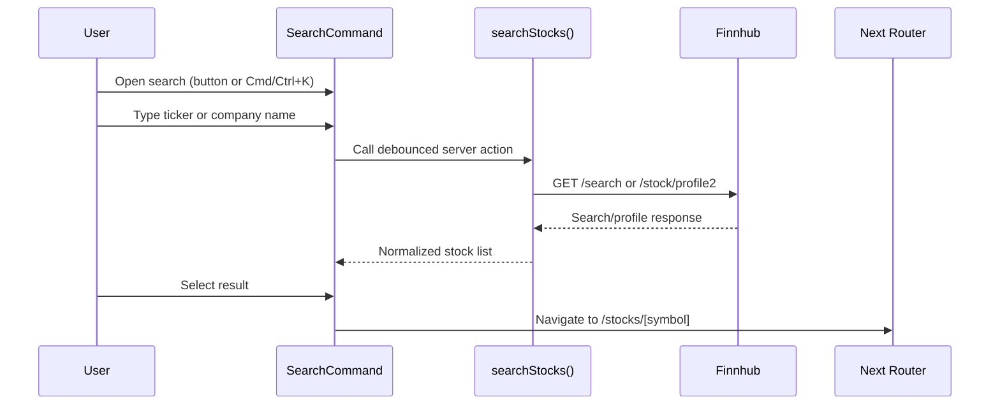

# Equipulse

Equipulse is a public-first stock dashboard built with Next.js 16, React 19, TradingView widgets, and Finnhub-backed stock search.

The current application is intentionally simple:

- no auth in the active route tree
- no required database for the main experience
- browser-local persistence for dashboard layout and watchlist
- public dashboard at `/`
- stock detail pages at `/stocks/[symbol]`

The main architecture document lives in [ARCHITECTURE.md](/Users/lawrence/Desktop/projects/portfolio_projects/equipulse/ARCHITECTURE.md).

## Screenshots

### Dashboard



### Stock Detail



## Current State

As of `2026-03-31`, the app is operating as a portfolio-style public market dashboard rather than a full authenticated product.

### Active Runtime Features

- public market dashboard with draggable and resizable widgets
- sticky header with stock search
- stock detail pages with multiple TradingView embeds
- browser-local watchlist storage
- browser-local dashboard layout persistence
- Finnhub-backed stock search helpers

### Recent Changes Reflected In This Repo

- removed the active auth route tree from `app/`
- removed the active Inngest API route from `app/api/`
- standardized the public dashboard around browser-local state
- fixed dashboard hydration issues by using deterministic initial layouts and container measurement before mount
- reduced grid row height to remove large empty gaps between widgets
- simplified page height handling and reduced excess bottom spacing
- tightened header height and container spacing
- kept TradingView on the stable script-embed path after reverting the failed Web Component experiment

## Runtime Architecture

### High-Level Diagram



### Route Map

```text
app/
├── layout.tsx
├── globals.css
└── (root)/
    ├── layout.tsx
    ├── page.tsx
    └── stocks/
        └── [symbol]/
            └── page.tsx
```

### What Is Active In The Repo

| Area | Status | Notes |
|---|---|---|
| Public dashboard | Active | Core experience |
| Stock details page | Active | `/stocks/[symbol]` |
| Finnhub search helpers | Active | Server-side helpers in `lib/actions/finnhub.actions.ts` |
| Browser-local watchlist | Active | `components/WatchlistButton.tsx` |
| Browser-local layout persistence | Active | `lib/hooks/useDashboardLayout.ts` |

## Request Flow

### Search Flow



### Dashboard Rendering Flow

1. `app/(root)/page.tsx` renders `PublicDashboard`.
2. `useDashboardLayout()` loads the last saved layout from `localStorage`.
3. `useContainerWidth({ initialWidth: 1280, measureBeforeMount: true })` ensures the grid mounts with a stable width.
4. `ResponsiveGridLayout` renders widget slots from `DASHBOARD_WIDGETS`.
5. Each widget is mounted through `TradingViewWidget`, which injects the TradingView script directly into the container.

## Core Modules

### `app/`

- `app/layout.tsx`: global HTML shell and metadata
- `app/(root)/layout.tsx`: public shell with the shared header and container spacing
- `app/(root)/page.tsx`: homepage entrypoint
- `app/(root)/stocks/[symbol]/page.tsx`: stock detail page

### `components/`

- `Header.tsx`: server component that preloads popular stocks for search
- `NavItems.tsx`: nav links plus the search trigger
- `SearchCommand.tsx`: client search dialog with debounced Finnhub-backed results
- `PublicDashboard.tsx`: homepage dashboard grid
- `DashboardWidget.tsx`: wrapper around each widget tile
- `TradingViewWidget.tsx`: generic TradingView script embed component
- `WatchlistButton.tsx`: browser-local watchlist toggle

### `lib/`

- `lib/actions/finnhub.actions.ts`: server actions/helpers for stock search
- `lib/constants.ts`: navigation, widget configs, TradingView settings, and dashboard layout defaults
- `lib/hooks/useDashboardLayout.ts`: browser-local layout persistence
- `lib/utils.ts`: shared className helper

## State Model

### Browser-Local State

The current app stores personalization in the browser:

- dashboard layout: `eq_dashboard_layout`
- watchlist: `eq_watchlist`

This keeps the public experience fast and removes account friction.

### Server-Side State

The active runtime uses server-side code mainly for external fetches:

- Finnhub stock search
- TradingView widget configuration generation

There is no active user session state in the current route tree.

## External Services

### TradingView

TradingView powers the dashboard and stock detail widgets.

Current implementation details:

- dashboard widgets use TradingView script embeds
- stock detail views also use TradingView script embeds
- the app is not currently using TradingView Web Components
- the app is not currently using `lightweight-charts`

### Finnhub

Finnhub is used for:

- search suggestions
- stock lookup

The helpers are defined in [lib/actions/finnhub.actions.ts](/Users/lawrence/Desktop/projects/portfolio_projects/equipulse/lib/actions/finnhub.actions.ts).

## Environment Variables

Current `.env.example`:

```bash
FINNHUB_API_KEY=

# Optional: AI feature (disabled by default)
# AI_ENABLED=false
# OPENROUTER_API_KEY=
# AI_DAILY_REQUEST_CAP=50
```

### Required For The Active Public App

| Variable | Required | Purpose |
|---|---|---|
| `FINNHUB_API_KEY` | Yes | Stock search and news helpers |

### Optional / Deferred

| Variable | Required | Purpose |
|---|---|---|
| `AI_ENABLED` | No | Feature flag for future AI work |
| `OPENROUTER_API_KEY` | No | Future AI provider integration |
| `AI_DAILY_REQUEST_CAP` | No | Future AI cost ceiling |

## Development

### Install

```bash
npm install
```

### Run

```bash
npm run dev
```

### Verify

```bash
npm run lint
npm run typecheck
```

## Available Scripts

| Script | What it does |
|---|---|
| `npm run dev` | Starts Next.js dev server |
| `npm run build` | Production build using webpack |
| `npm run start` | Runs the production server |
| `npm run lint` | Runs ESLint |
| `npm run typecheck` | Runs `tsc --noEmit` |

## Repository Structure

```text
.
├── app/
├── ARCHITECTURE.md
├── components/
├── hooks/
├── lib/
├── public/
├── types/
├── APPLICATION_STRUCTURE.md
├── application-structure.mermaid
└── README.md
```

## Notes On Documentation Drift

Two older documentation artifacts still exist in the repo:

- `APPLICATION_STRUCTURE.md`
- `application-structure.mermaid`

They describe the earlier authenticated/Inngest-based architecture and no longer match the active app tree exactly. This README is the updated runtime description for the current public-first version.

## Planned Architecture Direction

The current repo direction is consistent with the portfolio architecture note in `_bmad-output/architecture-public-access-cost-control.md`:

- keep the app public-first
- avoid mandatory auth
- protect expensive features with rate limits and budgets instead of login
- keep layout and watchlist state browser-local where possible
- reintroduce AI only behind explicit caps and graceful fallbacks

That direction is documented, but not all cost-control features are implemented yet.
